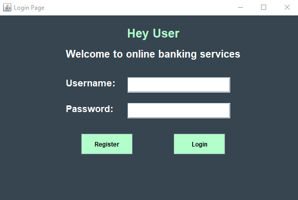
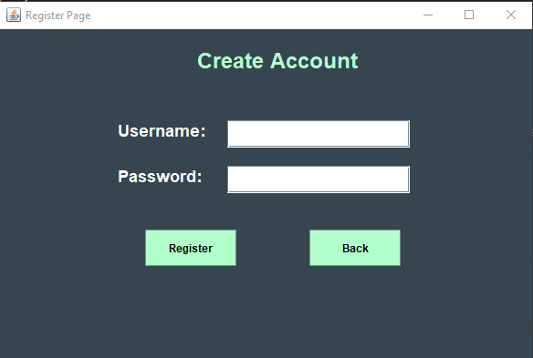
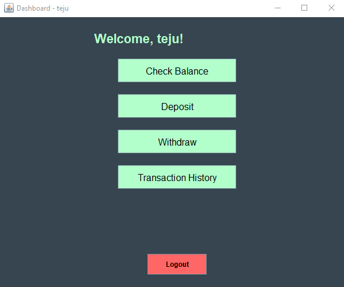

# 💳 Online Banking Management System

An interactive **Java GUI-based banking system** built using **Swing, JDBC, and MySQL** to simulate core banking operations.

---

## 🚀 Features

- 🔐 User Registration & Login
- 💰 Deposit & Withdraw Functionality
- 🧾 Transaction History Viewer
- 📊 Real-time Balance Display
- 🔓 Logout Feature
- 💻 Stylish UI (Charcoal Gray & Seafoam Green)

---

## 🛠️ Built With

- **Java (Swing)** – GUI design
- **MySQL** – Relational database
- **JDBC** – Java database connectivity

---

## 📁 Project Structure

```
OnlineBankingSystem/
│
├── Project Files/
│   ├── DBConnection.java        # Handles database connectivity
│   ├── Dashboard.java           # Main dashboard after successful login
│   ├── LoginPage.java           # Login screen for users
│   ├── RegisterPage.java        # Registration screen for new users
│
├── assets/
│   ├── Dashboard.png            # Dashboard UI screenshot
│   ├── LoginPage.png            # LoginPage UI screenshot
│   ├── RegisterPage.png         # RegisterPage UI screenshot
│
├── Demo Video/
│   └── Project Execution.mp4    # Demo video of the running project
│
└── README.md                    # Project documentation
```

## 📦 Prerequisites

- MySQL server running locally
- Java JDK installed (preferably 8+)
- MySQL JDBC Driver (.jar file)
- Any IDE (VS Code, IntelliJ, etc.)

---

## 🧾 How to Use

1. Import all `.java` files into your IDE.
2. Create a database named `banking` and ensure the required tables (`users`, `transactions`) are created.
3. Add MySQL JDBC `.jar` file to your project libraries.
4. Update `DBConnection.java` with your own DB username and password.
5. Run the `LoginPage.java` to get started.

---

## ⚠️ Disclaimer

- This project is created for **educational/demo purposes**.
- No encryption or password hashing is implemented.
- Do **not use in real banking systems or production environments**.

## 💻 Sample UI Screenshots

### 🔐 Login Page  


---

### 📝 Register Page  


---

### 📊 Dashboard Page  


---
## 📌 Author

Developed by **Adam Tejaswini**  
📧 Email: [adamtejaswini1432@gmail.com](mailto:adamtejaswini1432@gmail.com)
